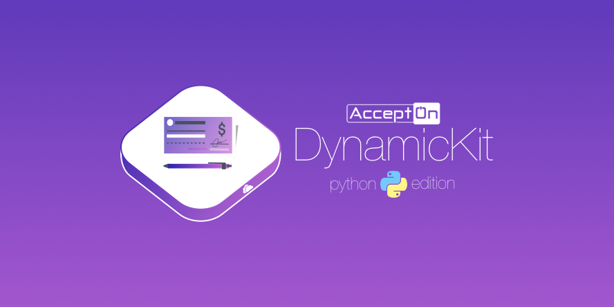

[](https://badge.fury.io/py/accepton)
[](https://circleci.com/gh/accepton/accepton-python)
[](https://github.com/accepton/accepton-python/blob/master/LICENSE)
[](https://twitter.com/AcceptOnHQ)


# What is this?
The [AcceptOn](https://accepton.com) *DynamicKit* for monty-pythoners.  Used for your backend integration with AcceptOn.

### Features
  - [x] Generate goods dynamically
  - [x] Verify that a charge completed and for the correct amount
  - [x] List and search charges
  - [x] Refund a charge
  - [x] Create, read, and list plans
  - [x] Cancel, retrieve, and list subscriptions
  - [x] CRUD promo-codes


## Setup

#### 1. Install the PyPI package
```sh
>pip install accepton
```

#### 2. Initialize the client
```python
from accepton import Client

#Located under 'My Profile' in your accepton.com dashboard
ACCEPTON_SECRET_KEY = 'skey_xxxx'

#The environment may be either 'production' or 'staging'
client = Client(api_key=ACCEPTON_SECRET_KEY, environment='staging')
```

#### 3. Pick an example

 - [A RESTful service that auto-configures `CheckoutKit` and verifies the charge](./docs/RESTful_example.md)
 - [Listing charges for a particular date range](./docs/listing_charges.md)
 - [Refunding a charge](./docs/refund_charge.md)
 - [Create, read, and list plans](./docs/plans.md)
 - [Cancel, retrieve, and list subscriptions](./docs/subscriptions.md)
 - [CRUD promo-codes](./docs/promo.md)

## Contributing
> ♥ This project is intended to be a safe, welcoming space for collaboration, and contributors are expected to adhere to the [Contributor Covenant](http://contributor-covenant.org) code of conduct.

- If you **found a bug**, open an issue.
- If you **have a feature request**, open an issue.
- If you **want to contribute**, submit a pull request.

## Versioning
This project adheres to [Semantic Versioning 2.0.0](http://semver.org/spec/v2.0.0.html). Any violations of this scheme are considered to be bugs.
